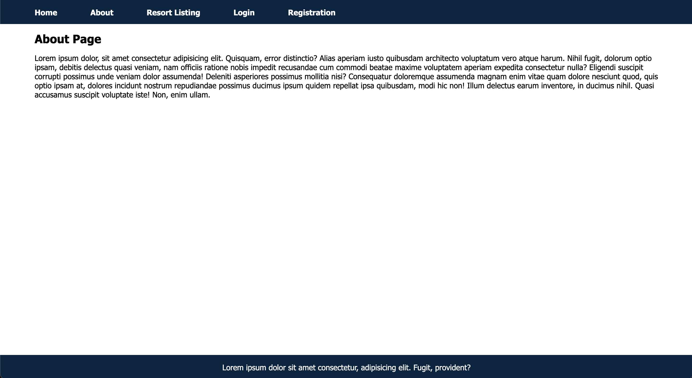
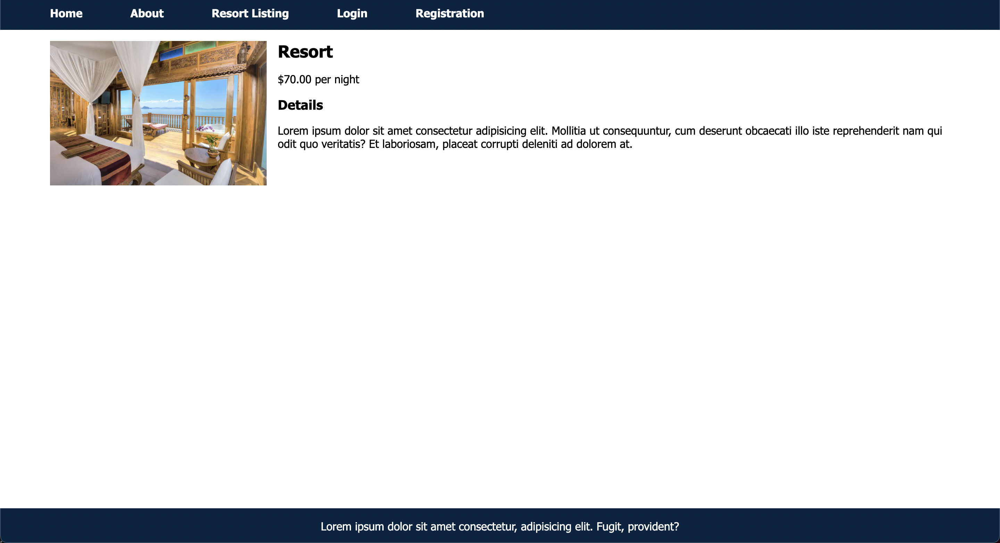
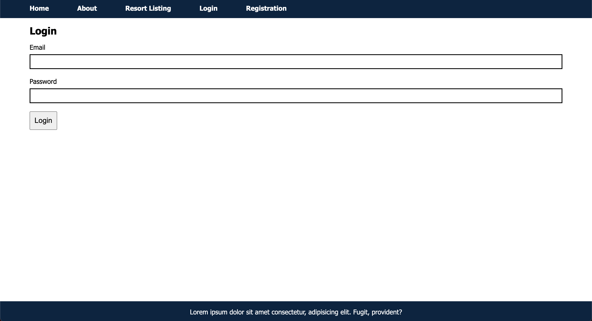
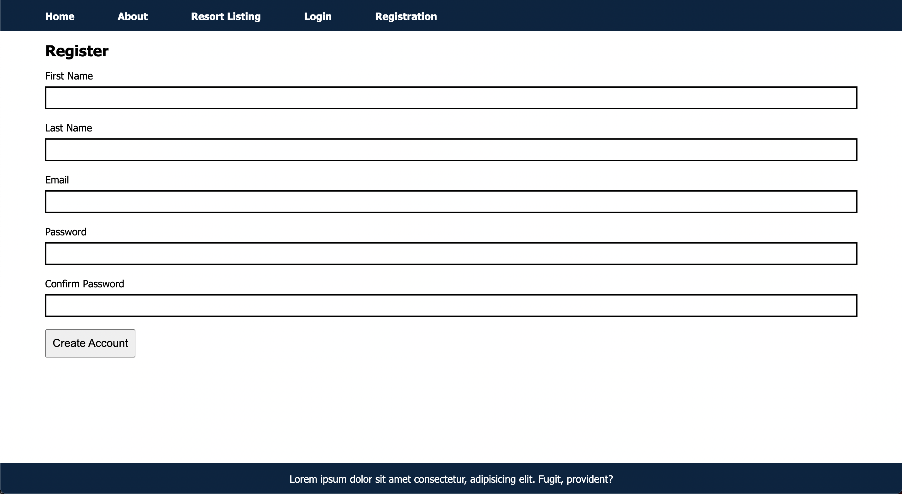

# Resort Website Starter Code

You are to take this starter code and develop it into a React app
## Home Page

## About

## Resort Property Listing Page

### Resort Property Detials Page

### Login

### Resitration Page

